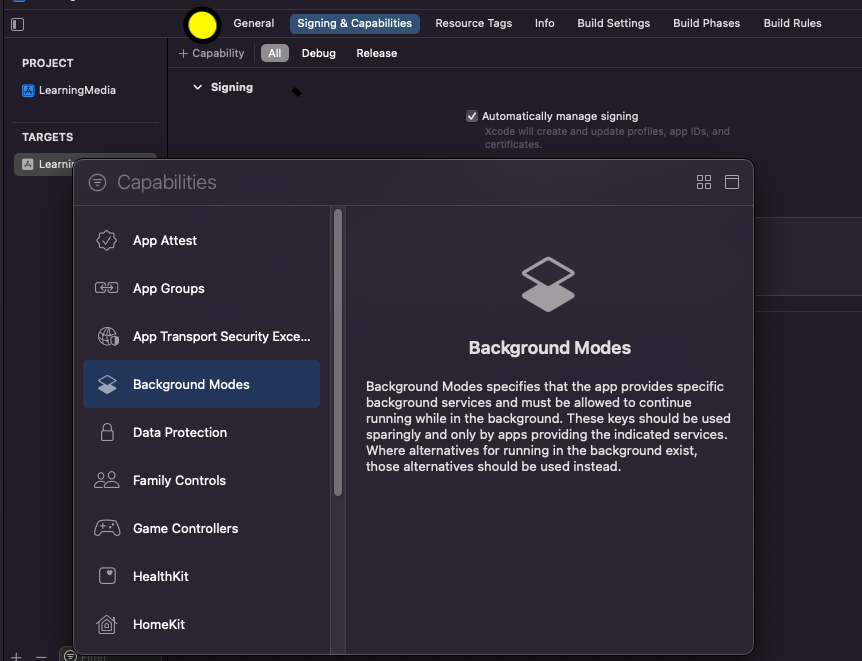
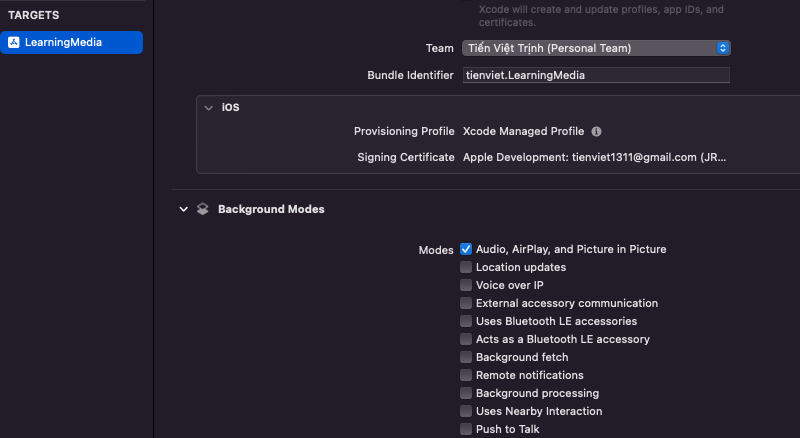
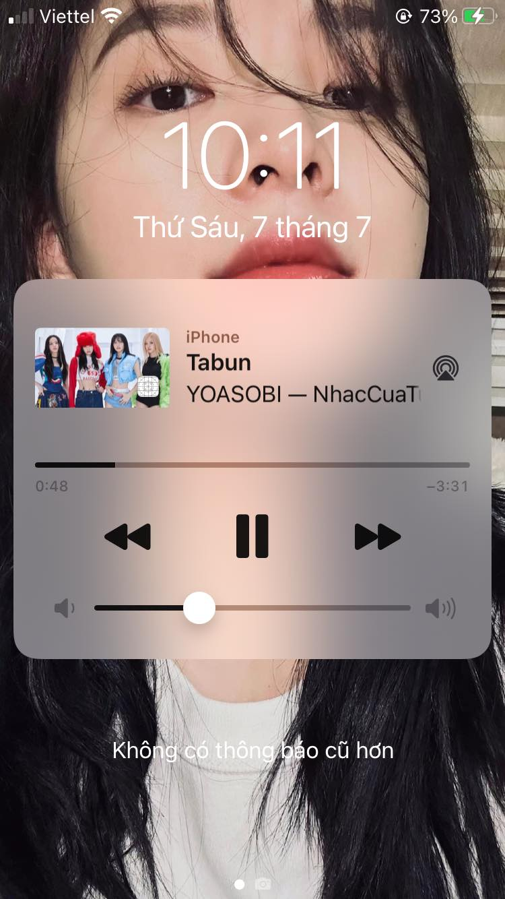

<a name="readme-top"></a>
# Learning MPMedia

Bài viết này gồm 2 phần: 
- Request Media from music's library: Nội dung chính là làm thế nào lấy được các media item, sau đó truy vấn đến các thuộc tính url, artist,... của đối tượng item đó.
- Play music in background and Mini Player Controller: Nội dung chính là làm thế nào có thể phát nhạc khi app ở background và khi vào màn lock screen sẽ có mini player như những app music.

<p align="right">(<a href="#readme-overview">Đọc tổng kết Phần 1</a>)</p>

# I. Request Media from music's library

Về cơ bản thì thư viện này giúp ta lâý được URL bài hát trong Apple Music, sau khi có URL của các bài hát, ta có thể play nhạc, next nhạc,... Chú ý rằng, ta chỉ có thể lấy URL của bài hát trong Apple Music, chứ không thể explore ra data trong FileManager. Hmm nhưng cũng đ hiểu sao, khi merge video với audio thì merge được.

Sau đây là các bước để có thể lấy được URL của các bài hát từ Apple Music.

<a name="readme-B1"></a>

## 1.1. Music Library Authorization

Để có thể lấy được URL bài hát, ta cần request authorization của user bằng cách add dòng này vào info.plist:
- `Privacy — Media Library Usage Description” key(NSAppleMusicUsageDescription)`

Sau khi add xong, ta sẽ gửi hàm request:

```php
func requestAuthorzation() {
    MPMediaLibrary.requestAuthorization { status in
        switch status {
        case .notDetermined:
            DispatchQueue.main.async {
                let url = URL(string:UIApplication.openSettingsURLString)!
                UIApplication.shared.open(url)
            }
        case .denied:
            DispatchQueue.main.async {
                let url = URL(string:UIApplication.openSettingsURLString)!
                UIApplication.shared.open(url)
            }
        case .restricted:
            break
        case .authorized:
            DispatchQueue.main.async {
                print("Siuuuuuu")
            }
    }
}
```

Method `requestAuthorization()` sẽ được request trên background Thread, do đó sau khi request completion complete, ta phải update data trên main Thread.

```php
DispatchQueue.main.async {
    let url = URL(string:UIApplication.openSettingsURLString)!
    UIApplication.shared.open(url)
}
```
Đoạn code này sẽ mở setting của user lên luôn.

<a name="readme-B2"></a>

## 1.2. Exploring the Music Library

Sau khi đã request Authorzation, ta sẽ tiến hành get song(bài hát), và từ song đó, ta sẽ lấy các Propeties của song đó như name, artist....

Mọi thứ trong music'library, được gọi là `MPMediaEntity` trong code. `MPMediaEntity` có 2 subclasses quan trọng sau:
- `MPMediaItem:` Đại diện cho 1 song
- `MPMediaItemCollection:`  Đại diện cho 1 list mã đã được sắp xếp của các `MPMediaItem`. Nó có thuộc tính `items` sẽ chứa 1 array các `MPMediaItem`.

Để có thể fetch được các property của 1 instance `MPMediaItem`, ta có thể sử dụng KVC như sau:
```php
// Fetch only one property at a time.
func value(forProperty property: String) -> Any?

// In some cases, enumerating the values for multiple properties can be more efficient than fetching each individual property with -valueForProperty:.
func enumerateValues(forProperties properties: Set<String>, using block: @escaping (String, Any, UnsafeMutablePointer<ObjCBool>) -> Void)
```

VD: Để có thể truy cập vào `title` property của `MediaItem` thì ta có 2 cách:
```php
let mediaItem = MPMediaItem()
mediaItem.value(forProperty: MPMediaItemPropertyArtist)  ///Cách 1
mediaItem.artist                                        /// Cách 2
```
<a name="readme-B3"></a>

## 1.3. Querying the Music Library

Ở phần 2, ta đã biết cách access các property của 1 bài hát. Giờ ở phần này, ta sẽ tiến hành get bài hát đó :). Để có thể get song, ta sẽ sử dụng query.

Có 2 cách để tạo 1 query

- Cách 1:

```php
let query: MPMediaQuery = MPMediaQuery()
```

Khi khởi tạo 1 biến query như này, ta đã lấy được toàn bộ song từ Library, và đéo cần làm gì nữa cả :))) Ngạc nhiên chưa. giờ ta chỉ cần làm như sau là lấy được mọi Item, nghĩa là đã lấy được mọi bài hát.

```php
let allsong: [MPMediaItem]? = query.items
print("DEBUG: \(query.items[0].artist)") /// "YOASOBI"
```

Để có thể thêm hoặc xoá điều kiện khi query, ta sử dụng

```php
func addFilterPredicate(_ predicate: MPMediaPredicate)
func removeFilterPredicate(_ predicate: MPMediaPredicate)
```

Ta có `MPMediaPropertyPredicate` là 1 subclass của `MPMediaPredicate`, nó cho phép ta tạo 1 predicate để thêm điều kiện khi query 1 media.

```php
class MPMediaPropertyPredicate : MPMediaPredicate {

    /*not inherited*/ init(value: Any?, forProperty property: String) // comparisonType is MPMediaPredicateComparisonEqualTo

    /*not inherited*/ init(value: Any?, forProperty property: String, comparisonType: MPMediaPredicateComparison)
    
    var property: String { get }    
    
    var value: Any? { get } 
    
    var comparisonType: MPMediaPredicateComparison { get }
}

enum MPMediaPredicateComparison : Int, @unchecked Sendable {    

    case equalTo = 0

    case contains = 1
}
```

Ví dụ:

```php
let predicate: MPMediaPropertyPredicate = MPMediaPropertyPredicate(value: songId, forProperty: MPMediaItemPropertyPersistentID)
let query: MPMediaQuery = MPMediaQuery()
query.addFilterPredicate(predicate)
```

- Cách 2: Sử dụng Convienence constructor

`MPMediaQuery` cung cấp một vài methods dùng để khởi tạo query mà giới hạn group type:
```php
open class func albums() -> MPMediaQuery

open class func artists() -> MPMediaQuery

open class func songs() -> MPMediaQuery

open class func playlists() -> MPMediaQuery

open class func podcasts() -> MPMediaQuery

open class func audiobooks() -> MPMediaQuery

open class func compilations() -> MPMediaQuery

open class func composers() -> MPMediaQuery

open class func genres() -> MPMediaQuery
```

VD: Để có thể lấy các media trong folder album ra, ta có thể sử dụng:
```php
let albumsQuery: MPMediaQuery = MPMediaQuery.albums()
```

- Như đã nói ở trên, sau khi đã tạo query, chúng ta có thể lấy data từ query đó.

```php
class MPMediaQuery {
    var items: [MPMediaItem]? { get }
    var collections: [MPMediaItemCollection]? { get }
    var groupingType: MPMediaGrouping 
}
```
Với:

- `items`: là 1 array của MPMediaItem.
- `collections`: query trả về 1 array của `MPMediaItemCollection`, mỗi phần tử là 1 group.
- `groupingType`: là 1 enum dùng để xác định xem query sẽ nhóm collections theo kiểu nào. Default value là .title.

Với `MPMediaGrouping`:

```php
public enum MPMediaGrouping : Int, @unchecked Sendable {
    case title = 0
    case album = 1
    case artist = 2
    case albumArtist = 3
    case composer = 4
    case genre = 5
    case playlist = 6
    case podcastTitle = 7
}
```

Tóm lại: Ta có 2 cách để query tất cả media trong albums.

<a name="readme-CollectionMedia"></a>

```php
// `Collections` sẽ được group theo từng album
// Cách 1
let albumsQuery: MPMediaQuery = MPMediaQuery.albums()

// Cách 2
let query: MPMediaQuery = MPMediaQuery()
query.groupingType = .album
```

Sau khi có item, để có thể play media, ta chỉ cần biến AVPlayer() như sau:

```php
func playMedia() {
    let query = MPMediaQuery()
    let aidoru = query.items!.first!
    let url = aidoru.assetURL!
    let playerItem = AVPlayerItem(url: url)
    print("DEBUG: \(url)")
    
    player = AVPlayer(playerItem: playerItem)
    player.play()
}
```

<a name="readme-overview"></a>

## 1.4. Tổng kết

Các bước thực thi
- B1: Request Authorzation: <p align="right">(<a href="#readme-B1">Get Authorization</a>)</p>
- B2: Query data: <p align="right">(<a href="#readme-B3">Query and Get Media</a>)</p>

Ta sẽ lấy được toàn bộ media từ music library chỉ thông qua việc khởi tạo: `let query: MPMediaQuery = MPMediaQuery()`. Sau đó ta có thể lấy các `media` thông qua property `items` của query. Đơn giản thê thôi :))))

Ta cũng có thể thêm điều kiện qua query bằng cách sử dụng `MPMediaPropertyPredicate`.

Chúng ta cũng có thể query theo collections, như albums, artists, podcast,.. thông qua việc sử dụng `let albumsQuery: MPMediaQuery = MPMediaQuery.albums()` hoặc `let query: MPMediaQuery = MPMediaQuery(); query.groupingType = .album` 

<p align="right">(<a href="#readme-CollectionMedia">Get Collection Media</a>)</p>

<p align="right">(<a href="#readme-top">back to top</a>)</p>

# II. Play music in background and Mini Player Controller

## 2.1 Play music in background

Bước 1: Để có thể play media in background ta select `Audio, AirPlay, and Picture in Picture` trong `Signing & Capabilities` như sau:

- Add Background Mode, nhấn `+Capacility`, sau đó add `BackgroundMode`



- Enable `Audio, AirPlay, and Picture in Picture`:



Bước 2: Trong `AppDelegate.swift`, ta replace func `application(_:didFinishLaunchingWithOptions:)` ở func ở dưới đây:

```php
import CoreAudio
import AVFoundation

func application(_ application: UIApplication, didFinishLaunchingWithOptions launchOptions: [UIApplication.LaunchOptionsKey: Any]?) -> Bool {

    let audioSession = AVAudioSession.sharedInstance()
    do {
        try audioSession.setCategory(AVAudioSession.Category.playback, mode: AVAudioSession.Mode.default)
    } catch let error as NSError {
        print("Setting category to AVAudioSessionCategoryPlayback failed: \(error)")
    }
    // Other project setup
    return true
}
```

Sau 2 bước này, media của chúng ta sẽ tiếp tục được play kể cả khi app vào background Thread.

## 2.2 Mini Player Controller

`MPRemoteCommandCenter` là 1 class cho phép ta tương tác với app music của mình. Bất cứ hành động như khi ta next , pause,... thì tất cả các sự kiện này sẽ được sử lý bởi **shared instance** của nó.

```php
func setupRomoteCommander() {
    let commander = MPRemoteCommandCenter.shared()
    
    commander.playCommand.addTarget { event in
        self.playMedia()
        return .success
    }
    
    commander.pauseCommand.addTarget { event in
        self.pauseMedia()
        return .success
    }
    
    commander.nextTrackCommand.addTarget { event in
        self.nextMedia()
        return .success
    }
    
    commander.previousTrackCommand.addTarget { event in
        self.previousMedia()
        return .success

    }
}

func playMedia() {
    player.play()
}

func pauseMedia() {
    player.pause()
}
```

Đoạn code này đã cho phép ta play() hoặc pause() video rồi. Đơn giản là ta sử lý các event người dùng thông qua các method mà `commander` cung cấp thôi như:
- playCommand
- pauseCommand
- nextTrackCommand
- previousTrackCommand
- ....

Hiện tại ta đã nhận được các event, giờ ta sẽ custom `Mini Player` như xét name media, artist, image,... 

```php
func setupRemoteComanderView() {
    guard let item = MPMediaQuery().items?.first else {return}
    var playingInfo = [String: Any]()
    playingInfo[MPMediaItemPropertyArtist] = item.title
    playingInfo[MPMediaItemPropertyArtist] = item.artist
    playingInfo[MPMediaItemPropertyAlbumTitle] = item.albumTitle
    playingInfo[MPMediaItemPropertyPlaybackDuration] = item.playbackDuration
    
    playingInfo[MPMediaItemPropertyArtwork] = MPMediaItemArtwork(boundsSize: CGSize(width: 40, height: 40), requestHandler: { size in
        return UIImage(named: "bp")!
    })
    
    MPNowPlayingInfoCenter.default().nowPlayingInfo = playingInfo
    
}
```



Nhưng vẫn có 1 vấn đề nữa, là khi tăng tốc độ `rate` lên 2, 0.5,.. thì thanh slider của `Mini Player` vẫn tốc độ như thế, vì vậy ta phải config chúng.

